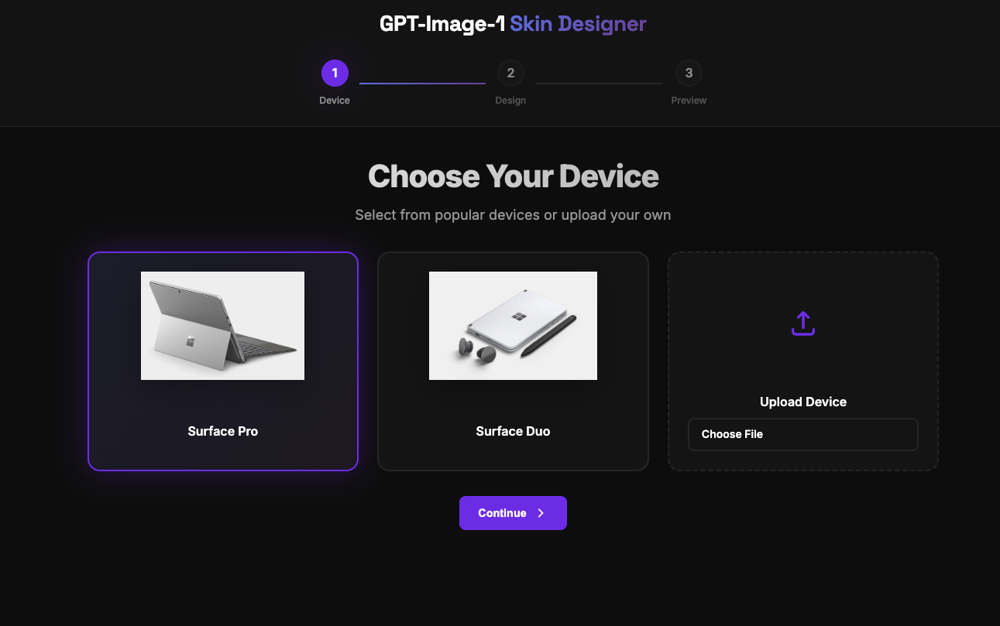
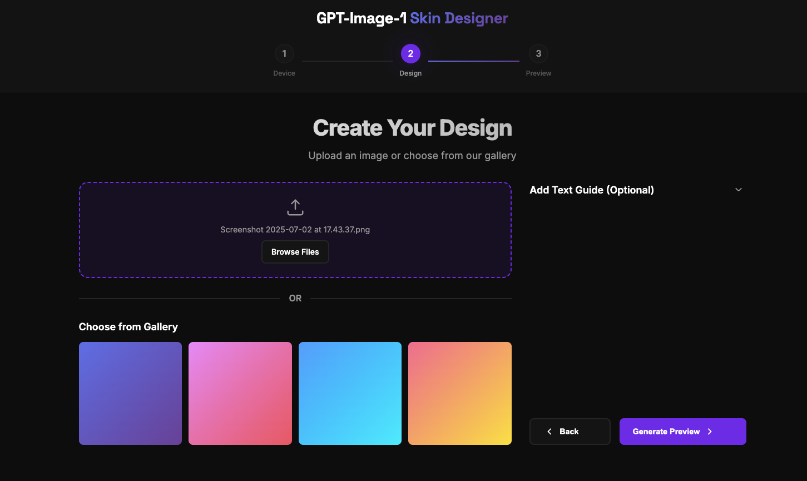
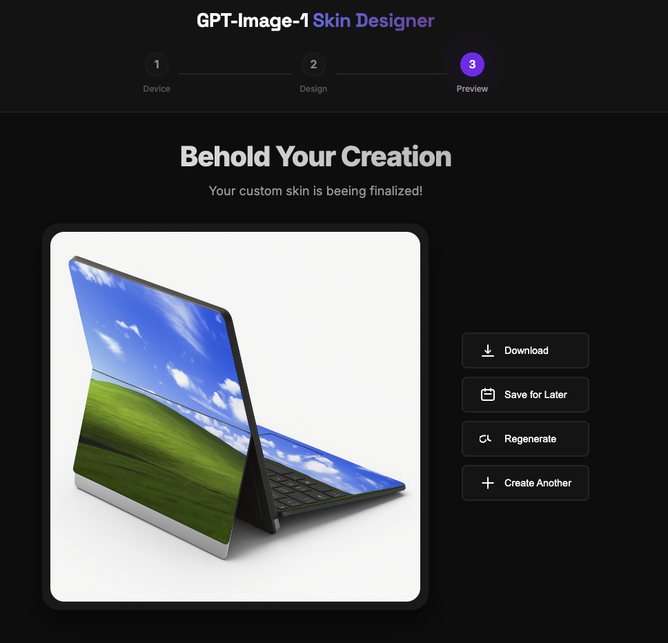
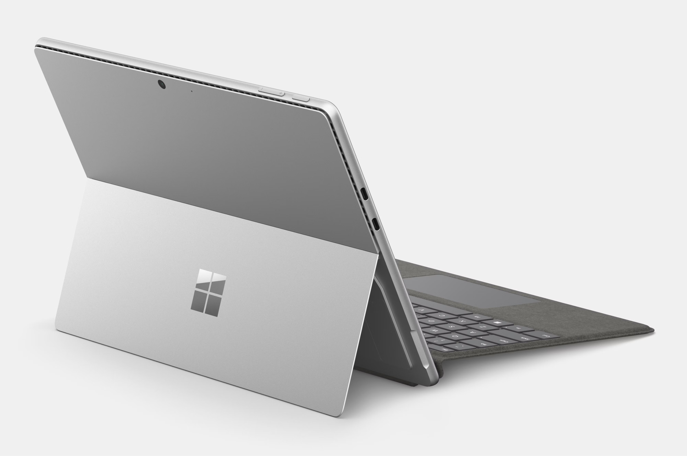
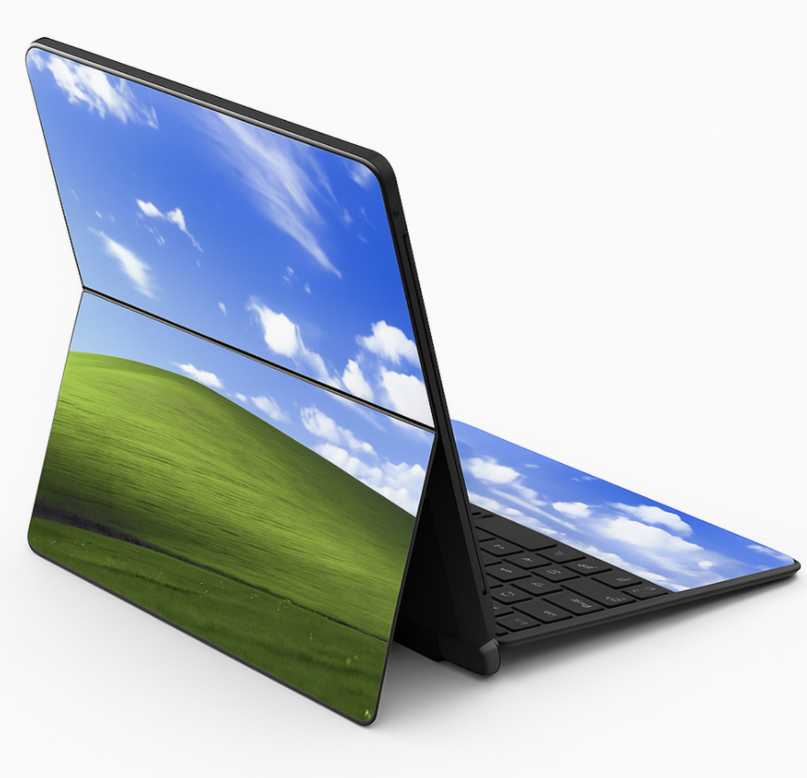

# GPT-Image-1 Skin Designer 🎨

A sample app that uses Azure OpenAI's GPT-Image-1 model to create custom device skins. Users can select from popular devices or upload their own, then apply custom designs using AI-powered image generation and editing.

## ✨ Features

- **AI-Powered Mask Generation**: Automatically creates precise masks for skin application areas
- **Design Application**: Upload custom images or use AI-generated designs
- **Real-time Preview**: See your custom skin applied to the device before downloading

## 🚀 Demo


*Step 1: Choose your device*


*Step 2: Upload or create your design*


*Step 3: Preview and download your custom skin*

## 🎭 Mask Generation Examples

The application automatically generates precise masks to identify where skins can be applied on devices:

### Input Device Image

*Original Surface Pro device image*

### Generated Mask

*AI-generated mask showing skin application areas (white regions)*

### Final Image


## 🛠️ Technology Stack

- **Frontend**: JavaScript (Vanilla)
- **Backend**: Python Flask
- **AI Model**: Azure OpenAI GPT-Image-1
- **Image Processing**: Pillow (PIL), NumPy
- **Caching**: File-based caching system

## 📋 Prerequisites

- Python 3.8+
- Azure OpenAI account with GPT-Image-1 deployment
- Modern web browser

## ⚙️ Installation

1. **Clone the repository**
   ```bash
   git clone <repository-url>
   cd skin-designer
   ```

2. **Create and activate virtual environment**
   ```bash
   python -m venv .venv
   source .venv/bin/activate
   ```

3. **Install dependencies**
   ```bash
   pip install -r requirements.txt
   ```

4. **Set up environment variables**
   ```bash
   cp .env.example .env
   ```
   
   Edit `.env` with your Azure OpenAI credentials:
   ```bash
   AZURE_IMAGE_API_ENDPOINT="https://your-endpoint.cognitiveservices.azure.com/openai/deployments/gpt-image-1"
   AZURE_IMAGE_API_KEY="your-api-key-here"
   AZURE_IMAGE_DEPLOYMENT_NAME="gpt-image-1"
   ```

## 🚀 Running the Application

1. **Start the Flask server**
   ```bash
   python app.py
   ```

2. **Open your browser**
   Navigate to `http://localhost:5000`

## 🎯 How It Works

1. **Device Selection**: Choose from pre-loaded devices or upload your own device image
2. **Mask Generation**: The app analyzes the device image and creates a precise mask indicating where skins can be applied
3. **Design Processing**: User-uploaded designs are processed and optimized for application
4. **AI Integration**: GPT-Image-1 intelligently applies the design to the masked areas
5. **Preview & Download**: Real-time preview of the final result with download capability
